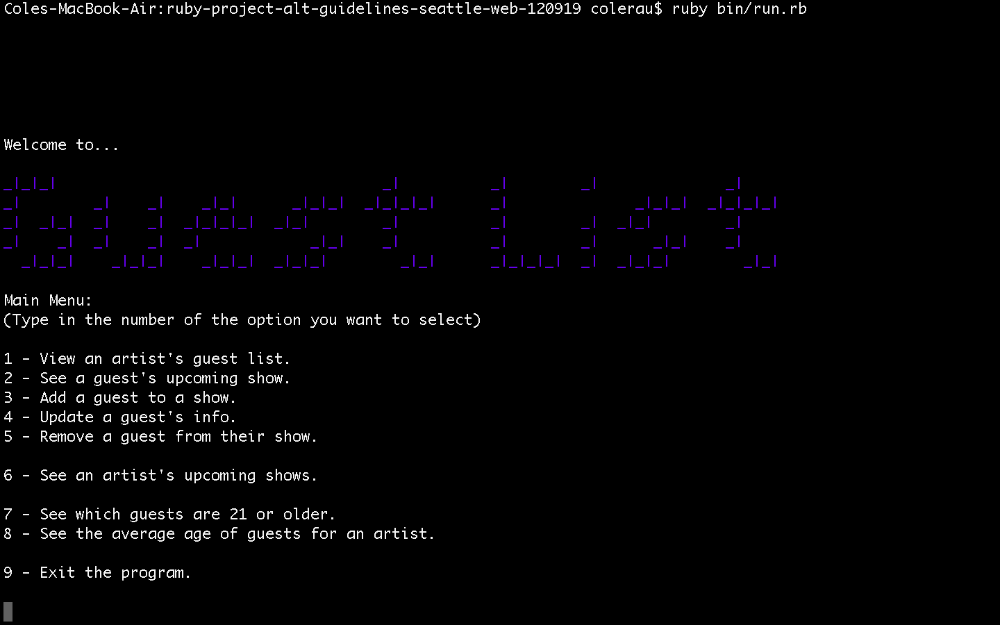
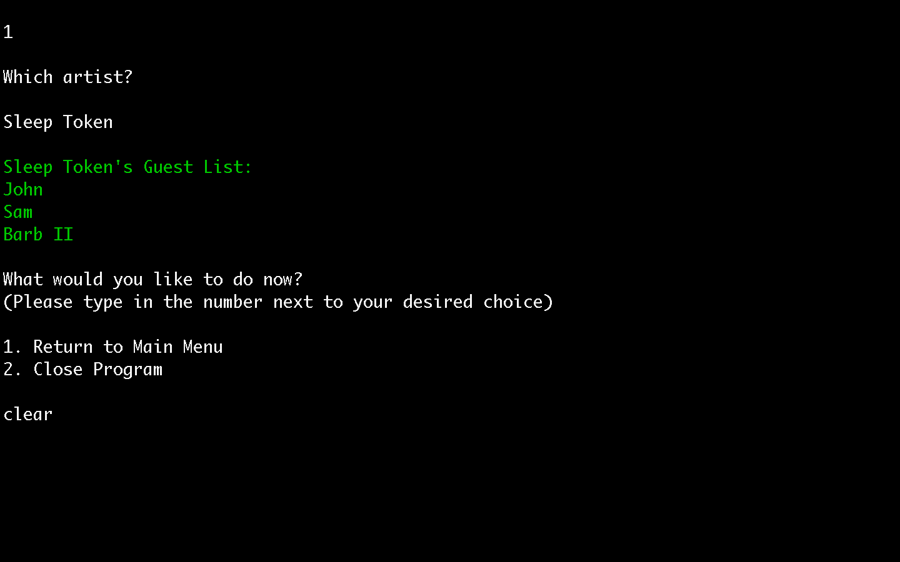

# Welcome to Guest List 

## Guest List is a program for record labels to manage each of their touring artists' guests.

### [Video Walkthrough](https://www.youtube.com/watch?v=P47zzHsZQMY) 
### How to Install: 
1. Fork and clone this repository. 
### How to Run: 
1. Open up a new terminal, making sure you are in this project's directory. 
2. Type `ruby bin/run.rb`
### How to Get Started: 
- Enter in a number 1-9 depending on which option of the main menu you choose!
### Screenshots: 

